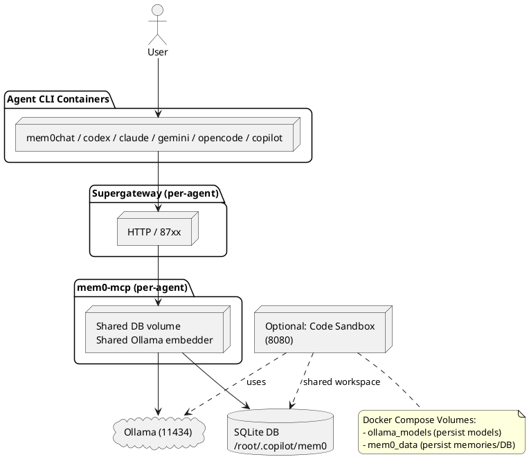

# System Architecture: AI Engineer Stack (v2)

## 1. Overview
This infrastructure enables a hybrid AI assistant with remote inference (OpenCode Zen), local memory management (Mem0), semantic search (Ollama embeddings), and isolated code execution (Docker sandboxes). The system is designed for multi-project scalability with persistent memory contexts and workspace isolation.

**Environment:** Kali Linux 2026.1 | Python 3.13 | Node.js v22 | Docker Compose

---

## 2. Component Stack

### 2.1 Brain: OpenCode Zen (Remote LLM Inference)
- **Type:** Cloud-hosted API (no local GPU required)
- **Endpoint:** `https://opencode.ai/zen/v1/chat/completions`
- **Models:** Big Pickle, GLM 4.7 Free, Kimi K2.5 Free, MiniMax M2.1 Free
- **Configuration:**
  - API Key: `OPENCODE_ZEN_API_KEY` environment variable
  - Custom URL: `OPENCODE_ZEN_URL` (for private/alternative endpoints)
  - Encrypted key file: `~/.config/opencode/zen-api-key.gpg` (auto-decrypt via script)
- **Security:** HTTPS/REST with secure credential management
- **Deployment:** Centralized external service (no local containers required)

### 2.2 Memory: Mem0 + Supergateway (MCP Bridge)
- **Mem0 Server:** Node.js + Python custom build
- **Supergateway Bridge:** Converts MCP protocol → HTTP (streamableHttp)
- **Topology (v2):** *Per-agent* Supergateway instances (one port per agent CLI)
- **Transport:** streamableHttp (NOT SSE, supports multiple clients)
- **Storage Backend:** SQLite at `~/.copilot/mem0/memories.sqlite`
- **Data:** Memories + embeddings (semantic vectors)
- **Scoping:** `workspace` + `project` dimensions for context isolation
- **Health Check:** `http://localhost:<agent_port>/healthz`

### 2.3 Embedder: Ollama (Local Semantic Search)
- **Container:** `ollama/ollama:latest` custom build
- **Port:** `11434` (exposed as `11435` in docker-compose)
- **Model:** `mxbai-embed-large:latest`
  - Size: 670 MB
  - Dimensions: 1024
  - Inference: <1s on CPU
- **Persistence:** `/root/.ollama` volume mount
- **Configuration:** `OLLAMA_KEEP_ALIVE=-1` (models always loaded)
- **Host Access:** `http://host.docker.internal:11434` (from containers) or `http://127.0.0.1:11434` (from host)
- **Health Check:** Model availability probe + embed API test

### 2.4 Action: Code Sandbox (Isolated Execution)
- **Container:** Playwright Python (`mcr.microsoft.com/playwright/python:v1.58.0-jammy`)
- **Service Name:** `code-sandbox` (exposed as `agent-gateway`)
- **Port:** `8080` (exposed as `8080`)
- **Framework:** FastAPI + Uvicorn
- **Capabilities:** Python, JavaScript, Bash execution with workspace isolation
- **Workspace:** Bind mount at `./workspace:/app/workspace`
- **Memory Integration:** Connects to Mem0 via a configurable MCP URL (default: `http://mem0-mcp:8765/mcp`)
- **Health Check:** `GET http://localhost:8080/health`
- **Start Period:** 40s (Playwright initialization)
- **Persistence:** Shared memory volume (`mem0_data`) with Mem0 container

### 2.5 Terminal Client: mem0chat (Interactive CLI)
- **Type:** Python 3.13 CLI with terminal UI
- **Location:** `mem0chat/mem0chat.py`
- **Dependencies:** OpenAI SDK, HTTPx, Prompt Toolkit, Rich, NotebookLM MCP CLI
- **Provider Options:**
  - `opencode-zen` (default, cloud LLM)
  - `ollama` (local Ollama inference)
  - `local` (system LLM)
- **Memory Integration:** Queries Mem0 via Supergateway HTTP endpoint
- **Scoping:** Workspace (`copernicus`) + project (auto-detected from git root)
- **Config Directory:** `~/.copilot/mem0/` for memories and session history
- **NotebookLM Support:** Optional `/nlm` commands for source-based research

### 2.5.1 Agent CLI Fleet (Containerized, v2)
Per Req0/Req1, each agent CLI runs in its own container and uses a dedicated Mem0 Supergateway port:
- `mem0chat-cli`
- `codex-cli`
- `claude-cli`
- `gemini-cli`
- `opencode-cli`
- `copilot-cli`
- `docker-ai-cli`

Each CLI container:
- Uses its dedicated Supergateway endpoint: `MEM0_MCP_URL=http://mem0-mcp-<agent>:8765/mcp` (in Docker) or `http://localhost:<agent_port>/mcp` (from the host)
- Shares the same persistent DB volume: `mem0_data:/root/.copilot/mem0` (single DB, single backup surface)
- Uses a shared “memory save” payload format (to be standardized)

### 2.6 Visualization: PlantUML Server
- **Container:** `plantuml/plantuml-server:jetty`
- **Port:** `8888` (exposed as `8888`)
- **Purpose:** Diagram/graph generation for documentation
- **Optional:** Can be disabled for minimal deployments

---

## 3. Architecture Diagram



---

## 4. Communication Flow

### User Interaction → Response (Per-Agent, Req0–Req2)
1. **Input routing:** The user selects the target agent CLI container (e.g. `codex-cli`, `claude-cli`, `mem0chat-cli`). (Req1)
2. **Memory search:** The selected CLI queries its dedicated Supergateway endpoint for relevant memories:
   - Endpoint: `POST http://localhost:<agent_port>/mcp`
   - Goal: fetch top‑K most relevant memories to keep prompt tokens bounded.
3. **Embedding + DB:** The `mem0-mcp` process behind that Supergateway calls a single shared Ollama embedder and reads from the shared DB:
   - Ollama: `http://ollama:11434`
   - Store: shared volume mounted at `/root/.copilot/mem0` (Req3)
4. **Context assembly:** The CLI builds the final prompt from “user query + retrieved memories”.
5. **Inference:** The CLI calls the selected agent provider (OpenAI/Codex, Claude, Gemini, OpenCode, Copilot, etc.).
6. **Memory save:** The CLI stores memories through the same per-agent Supergateway endpoint:
   - Endpoint: `POST http://localhost:<agent_port>/mcp` (memory/create or equivalent tool)
7. **Output:** The response is returned to the user.

### System Bootstrap Sequence
```
1. docker compose up -d ollama
2. Embedding model pull (first run)
3. docker compose up -d mem0-mcp mem0-mcp-codex mem0-mcp-claude mem0-mcp-gemini mem0-mcp-opencode mem0-mcp-copilot mem0-mcp-docker-ai
4. docker compose --profile agent-clis run --rm -it <agent-cli>
```

---

## 4.1 Requirement Justification (Performance, Token Usage, Persistence)

### Req0 — One container per agent CLI
- **Performance/QoS:** A slow agent (dependencies, rate limits, long inference) does not block others (reduced head-of-line blocking). Resource limits can be applied per agent.
- **Token usage:** Each agent can tune memory retrieval (top‑K, filters, `MEM0_SEARCH_LIMIT`) instead of using one monolithic prompt strategy.
- **Persistence:** Per-container session state is isolated, while long-term memory remains shared in the persistent store (Req3).

### Req1 — Send the user query to mem0chat and other agent CLIs independently
- **Performance:** Parallel runs across agents (comparison/ensemble) without queueing behind a single gateway.
- **Token usage:** Each agent receives only the context it needs; avoids “one giant prompt for everything”.

### Req2 — One Supergateway port per CLI + shared embedder/store
- **Performance:** Separating Supergateway + `mem0-mcp` per agent distributes load and allows per-agent timeouts/limits. Port-based routing/debug is simple from the host.
- **Token usage:** Per-port scoping (workspace/project/agent) makes memory results more relevant → fewer irrelevant memories → lower prompt tokens.
- **Inter-agent persistence:** All gateways share the same `mem0_data` volume (single source of truth). A shared memory-save format (to be finalized) ensures consistent metadata/indexing.
  - Note: a shared SQLite file can bottleneck on heavy concurrent writes; WAL + retry/backoff and write throttling should be part of the design.

### Req3 — Mount `/root/.copilot/mem0` as a shared volume
- **Performance:** A single volume simplifies backup/restore and disk I/O profiling.
- **Token usage:** Shared long-term memory reduces repeated explanations and re-learning across agents.
- **Persistence:** Memory survives container rebuilds/restarts; all agents benefit from the same history.

## 5. Data Flow & Isolation

### Memory Scoping
- **Workspace:** Top-level context (e.g., `copernicus`, `agents`)
- **Project:** Sub-context within workspace (e.g., `default`, `gateway`)
- **Benefits:** Multiple projects share embedder/DB but keep memories separate

### Container Isolation
- **Network:** `mem0-network` bridge (inter-container communication)
- **Host Access:** `host.docker.internal` DNS alias for host services (Ollama)
- **Volume Sharing:** `mem0_data` shared volume mounted at `/root/.copilot/mem0` (Req3)
- **Workspace Bind Mount:** `./workspace` on host → `/app/workspace` in Code Sandbox

### Security Boundaries
- Ollama: Local-only bind (127.0.0.1) by default
- OpenCode Zen: HTTPS with credential encryption
- Code Sandbox: Isolated filesystems per execution, no host system access
- Mem0 DB: No public network exposure (localhost only)

---

## 6. Key Deployment Rules

> [!IMPORTANT]
> **Rule 1: One OpenCode Zen brain, multiple memory contexts.**  
> Keep OpenCode Zen centralized (cloud API), scale memory via Mem0 workspaces and projects.
>
> **Rule 2: Remote inference by default, local embeddings always.**  
> LLM inference: cloud (OpenCode Zen). Embeddings: local Ollama (deterministic, no API costs).
>
> **Rule 3: Container network is the communication layer.**  
> Use container DNS names (`mem0-mcp-<agent>:8765`, `ollama:11434`) inside docker-compose. Use `localhost:<agent_port>` for host→container access.
>
> **Rule 4: Workspace + Project = Memory Isolation.**  
> Always set `MEM0_WORKSPACE` and `MEM0_PROJECT` to keep contexts clean. Different projects in same workspace share embeddings but not memories.
>
> **Rule 5: Health checks are mandatory.**  
> All containers have health checks. docker-compose respects `depends_on: condition: service_healthy`. Monitor `/healthz` endpoints in production.
>
> **Rule 6: Volumes persist across restarts.**  
> `ollama_models` and `mem0_data` are permanent. Backup these volumes for disaster recovery.

---

## 7. Service Dependencies & Health Checks

| Service | Port | Depends On | Health Check | Start Period |
| :--- | :--- | :--- | :--- | :--- |
| **ollama** | 11435 | — | Directory exists | 10s |
| **mem0-mcp-\*** | 87xx | ollama | `GET /healthz` (200) | 10s |
| **code-sandbox** | 8080 | ollama, mem0-mcp | `GET /health` (200) | 40s |
| **plantuml** | 8888 | — | (built-in) | — |

---

## 8. Port Mapping (localhost)

| Service | Container Port | Host Port | Protocol | Access |
| :--- | :--- | :--- | :--- | :--- |
| Ollama | 11434 | 11435 | HTTP/REST | `http://localhost:11435/api/tags` |
| Mem0 Supergateway (mem0chat) | 8765 | 8766 | HTTP (streamableHttp) | `http://localhost:8766/mcp` |
| Mem0 Supergateway (codex) | 8765 | 8767 | HTTP (streamableHttp) | `http://localhost:8767/mcp` |
| Mem0 Supergateway (claude) | 8765 | 8768 | HTTP (streamableHttp) | `http://localhost:8768/mcp` |
| Mem0 Supergateway (gemini) | 8765 | 8769 | HTTP (streamableHttp) | `http://localhost:8769/mcp` |
| Mem0 Supergateway (opencode) | 8765 | 8770 | HTTP (streamableHttp) | `http://localhost:8770/mcp` |
| Mem0 Supergateway (copilot) | 8765 | 8771 | HTTP (streamableHttp) | `http://localhost:8771/mcp` |
| Mem0 Supergateway (docker-ai) | 8765 | 8772 | HTTP (streamableHttp) | `http://localhost:8772/mcp` |
| Code Sandbox | 8080 | 8080 | HTTP/REST | `http://localhost:8080/health` |
| PlantUML | 8080 | 8888 | HTTP | `http://localhost:8888` |

---

## 9. Environment Configuration

### Ollama
```bash
OLLAMA_HOST=0.0.0.0:11434
OLLAMA_KEEP_ALIVE=-1
```

### Mem0 MCP
```bash
MEM0_WORKSPACE=copernicus
MEM0_PROJECT=default
MEM0_STORE_PATH=/root/.copilot/mem0
OLLAMA_BASE_URL=http://ollama:11434
MEM0_EMBED_MODEL=mxbai-embed-large:latest
MEM0_OLLAMA_TIMEOUT_MS=60000
```

### Code Sandbox
```bash
OPENCODE_ZEN_API_KEY=${OPENCODE_ZEN_API_KEY}
OPENCODE_ZEN_URL=${OPENCODE_ZEN_URL}
MEM0_MCP_URL=http://mem0-mcp:8765/mcp
MEM0_WORKSPACE=agents
MEM0_PROJECT=gateway
```

### Host System (Systemd Services)
```bash
# ~/.config/systemd/user/ollama.service
OLLAMA_HOST=127.0.0.1:11434
OLLAMA_KEEP_ALIVE=-1

# ~/.config/systemd/user/mem0-supergateway.service
# Runs mem0-mcp via Supergateway bridge
```

---

## 10. Deployment Scenarios

### Scenario A: Local Development (docker-compose)
```bash
docker-compose up -d
# All services on localhost, docker network for inter-service comms
```

### Scenario B: Systemd User Services (Production Kali)
```bash
sudo loginctl enable-linger $USER
systemctl --user start ollama mem0-supergateway
# Services run as unprivileged user, systemd manages restarts
```

### Scenario C: Hybrid (Systemd + Docker)
```bash
# Ollama + Supergateway via systemd
# Code Sandbox via docker-compose
# Requires network configuration for inter-service comms
```

---

## 11. Troubleshooting Quick Reference

| Symptom | Cause | Fix |
| :--- | :--- | :--- |
| Supergateway crashes "Already connected to a transport" | Multiple clients on SSE mode | Use `--outputTransport streamableHttp` |
| mem0 timeout "10000ms Ollama" | Cold start or slow embeddings | Set `MEM0_OLLAMA_TIMEOUT_MS=60000` |
| Code Sandbox healthcheck fails | Playwright not initialized | Increase start_period to 50-60s |
| Ollama high CPU | Large model + no GPU acceleration | Use `mxbai-embed-large` (670MB) not qwen3 (4.7GB) |
| mem0-health reports `modelAvailable: false` | False negative (embeddings work anyway) | Verify with semantic search tool instead |
| Cannot reach mem0-mcp from host | Docker network isolation | Use `localhost:<agent_port>` (e.g. `8766–8772`), not container DNS/port |

---

## 12. Scaling & Future Enhancements

### Current Limits
- Single Ollama instance (1 embedding model)
- Multiple Supergateways (per-agent) but **shared** DB (SQLite file locking is the bottleneck)
- Single Code Sandbox (sequential execution)
- Memory DB: SQLite (single-file; WAL helps but heavy write concurrency still bottlenecks)

### Scaling Options
1. **Multiple Workspaces:** Add `MEM0_WORKSPACE=project2` containers (separate instances)
2. **Load Balance Code Sandbox:** Multiple `code-sandbox-N` containers, reverse proxy on 8080
3. **Scale Mem0:** Replace SQLite with PostgreSQL + vector DB (e.g., pgvector)
4. **Distributed Ollama:** Pull larger models, multi-GPU setup
5. **Remote Deployment:** Move Supergateway + Ollama to remote servers, configure via HTTP

---

## 13. Backup & Disaster Recovery

### Critical Artifacts
- `ollama_models` volume (model weights, 670MB+ per model)
- `mem0_data` volume (memories.sqlite + embeddings, grows with usage)
- `~/.copilot/mcp-config.json` (MCP server definitions)
- `~/.local/bin/mem0-gateway` (wrapper script with env vars)

### Backup Command
```bash
tar czf mem0-backup-$(date +%Y%m%d-%H%M%S).tar.gz \
  -C / $(docker volume inspect mem0_data --format='{{.Mountpoint}}') \
        $(docker volume inspect ollama_models --format='{{.Mountpoint}}')
```

### Restore Command
```bash
tar xzf mem0-backup-*.tar.gz -C /
docker-compose up -d
```

---

*Document Version: 2.0.0*  
*Last Updated: 2026-04-13*  
*System Target: Kali Linux 2026.1 | Docker 26+ | Python 3.13 | Node.js v22*  
*Maintenance: Monitor health endpoints; backup volumes weekly; review logs for anomalies.*
